# Noteneingabe

Öffnen Sie MyMAGELLAN per Doppelklick auf Ihre Datei (*.mym) oder starten Sie das Programm MyMAGELLAN  und laden über `Datei > Öffnen`.
Es gibt zwei Ansichten für die Eingabe, einmal für die Datenerfassung je Schüler (Leistungen, weitere Zeugnisdaten, Zeugnisbemerkugne, Fehlzeitern) oder aus Sicht eines Faches (Leistungen).

 
 

!!! warning "Wichtig"

    Alle Eingaben beruhen auf zuvor in MAGELLAN festgelegten Schlüsselverzeichnissen für Noten und Zeugnisbemerkungen.
    Die Eingabe von selbst definierten Noten oder Veränderung von Schülerstammdaten ist nicht möglich! Wenden Sie sich in diesem Fall an Ihren Administrator.

## Sortieren, Gruppieren, Filtern usw.

Bevor die Ansichten erklärt werden, beschreiben wir die generellen Funktionalitäten, die bei der Eingabe zur Verfügung stehen. Es gibt einige Möglichkeiten die Liste zu filtern, zu sortieren, zu gruppieren usw. 

### Sortieren

Klicken Sie mit der linken Maustaste auf einen der Spaltenköpfe, die Inhalte der Spalte werden auf- oder absteigend sortiert.    Beispiel:  Sie klicken auf den Spaltenkopf der Spalte Klasse, die Klassen werden beim ersten Klick aufsteigend sortiert, beim erneuten Klick wird die Reihenfolge umgekehrt.

### Mehrfachsortierung 

Möchten Sie, dass die Schüler nach den Klassen sortiert werden und aber auch innerhalb der Klasse in alphabethischer Reihenfolge gezeigt werden, klicken Sie als erstes auf den Spaltenkopf der Spalte `Klasse`, halten anschließend die SHIFT-Taste fest und klicken dann auf den Spaltenkopf der Spalte `Nachname`.

### Gruppieren

Um zu Gruppieren ziehen Sie den Spaltenkopf der Spalte mit gedrückter Maustaste hoch wie in der Abbildung. 

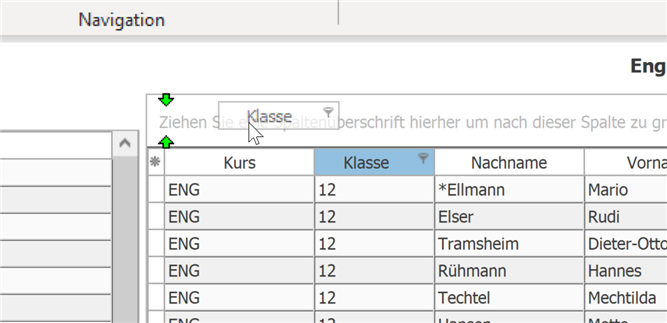

Die einzelnen Zeilen werden je nach Inhalt gruppiert, über die kleinen Dreiecke vor der Bezeichnung kann man eine Gruppierung öffnen oder schließen.

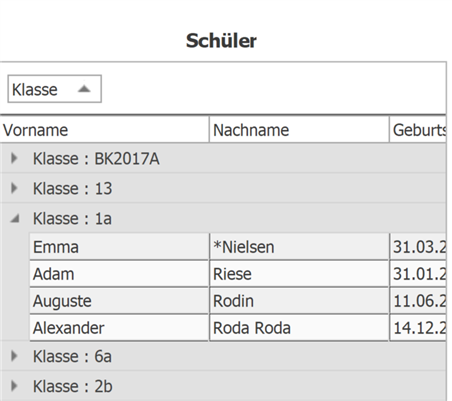

Um eine Gruppierung wieder aufzuheben, ziehen Sie den Spaltenkopf der gruppierten Spalte soweit nach unten, dass ein Kreuz gezeigt wird und lassen los. 

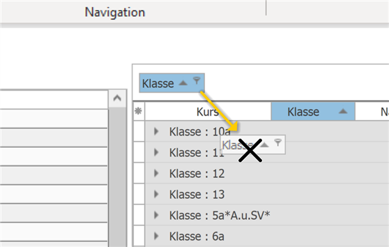

### Filtern

Beim Filtern kann man Inhalte ausblenden. Im nachstehenden Beispiel werden nach der Filterung nur die Fachzeilen mit der Unterrichtsart `GK` gezeigt. Dazu fahren Sie mit dem Mauszeiger über den Spaltenkopf der Spalte `Unterrichtsart` und klicken auf das erscheinde Filtersymbol.

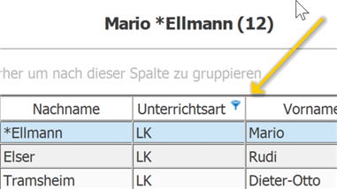

In der Klappliste werden je nach gewähltem Spaltenkopf die Inhalte der Spalte gezeigt, in diesem Fall GK und LK. Setzen Sie das Häkchen vor dem Wert oder vor den Werten die gezeigt werden sollen, alle anderen Zeilen werden ausgeblendet.

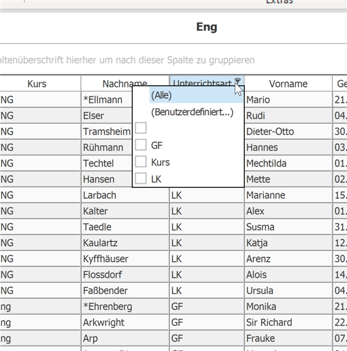

Nach was die Liste gefiltert wurde, wird am unteren Rand in der Filterzeile gezeigt. 

Um alle Einträge der Liste wieder angezeigt zu bekommen, schließen Sie den Filter über das Kreuzchen unten links in der Filterleiste.

### Inkrementelle Suche

Der schnellste Weg einen Datensatz innerhalb einer Liste zu finden ist die inkrementelle Suche. Diese Suchmöglichkeit funktioniert in sämtlichen Spalten:

* Klicken Sie auf einen beliebigen Wert einer Spalte, als Zeichen, dass Sie in dieser Spalte suchen möchten. Beispiel: Klicken Sie auf einen beliebigen Nachnamen um innerhalb der Nachnamen suchen zu können.

* Tippen Sie einen Wert ein. Beispiel: Sie suchen Schüler Müller, Sie tippen ein m, MAGELLAN bringt Sie zur ersten gefundenen Schüler dessen Nachname mit M beginnt. Tippen Sie mü, der Cursor springt in die nächste gefunden Zeile, dass könnte aber auch Schüler Mühlhausen sein. Tippen Sie Müller, springt der Cursor zum ersten Schüler mit dem Nachnamen Müller.

* Innerhalb der zutreffenden Schülerzeilen, also innerhalb der Schüler mit dem Nachnamen Müller, können Sie jetzt mit `STRG + Pfeil` aufwärts oder `STRG + Pfeil abwärts` sich bewegen.

### Spaltenreihenfolge

Die Listen haben links neben dem ersten Spaltenkopf ein kleines Symbol in Form eines Zahnrades.

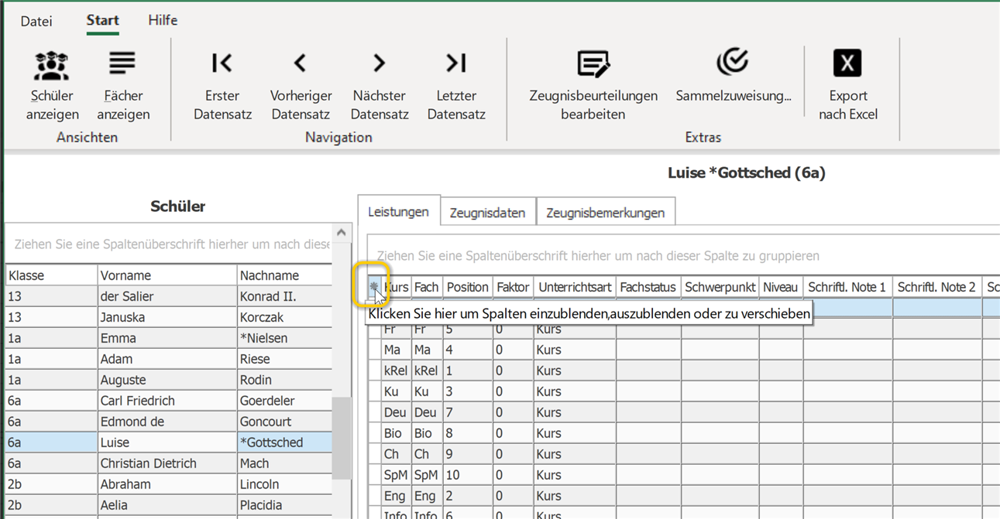

Öffnen Sie den Dialog per Mausklick, es werden alle verfügbaren Spalten gezeigt. Wollen Sie beispielsweise die Spalte Endnote weiter vorn in der Liste positionieren, schieben Sie die `Endnote` mit gedrückter linker Maustaste auf die gewünschte Position weiter oben in der Liste. Es werden grüne Pfeile als Sprungmarken angezeigt, lassen Sie die Spalte wie in der nachfolgenden Abbildung an dieser Position los, positioniert sich die `Endnote` zwischen `Schwerpunkt` und `Niveau`.

### Spaltensichtbarkeit

Welche Spalten und Felder in der Datei sichtbar sind, grenzt Ihr Administrator beim Erstellen der Dateien ein. Dabei sollten in der Datei immer nur die Spalten/Felder enthalten sein, die von Ihnen gepflegt werden sollen plus Spalten, die für das Erstellen einer bestimmten Reihenfolge wichtig sind. Beispiel: Sie können die Unterrichtsart der Schüler nicht über MyMAGELLAN nicht editieren, benötigen diese Spalte aber um die Schüler des Deutsch Grundkurse korrekt zu sortieren.

Spalten, die gezeigt werden, die Sie aber nicht benötigen, könenn Sie aus den Listen ausblenden. Dafür entfernen Sie bitte das Häkchen wie in der nachstehenden Abbildung für die Beispiele `Position` und `Schwerpunkt`.

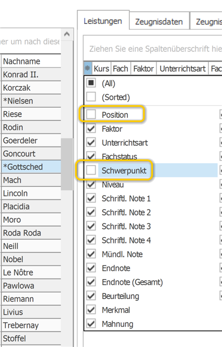

## Eingabe nach Schülern

Um die Daten für Ihre Schüler einzugeben klicken Sie bitte auf die Schaltfläche `Schüler anzeigen` oben links in der Menüleiste.

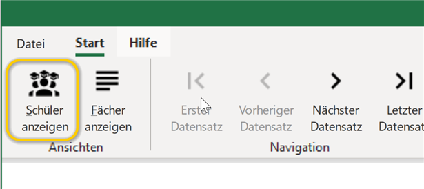

In der sich öffnenden Ansicht ist das Fenster zweigeteilt: links ist die Liste der Schüler, auf der rechten Seite werden je nach Unterkarte die Daten erfasst. 
Die Schüler, die auf der linken Seite gezeigt werden, können gefiltert, gruppiert oder sortiert werden. 

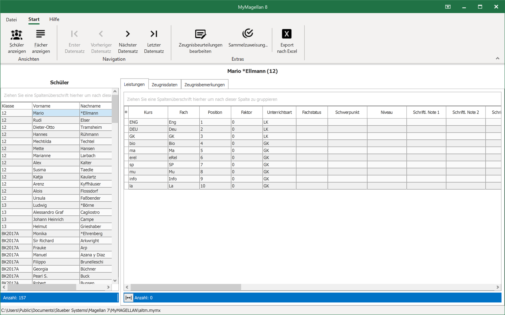

!!! info "Hinweis"

    Die angezeigten Spalten und Felder, die Bearbeitbarkeit und auch teilweise die Benennung der Spalten hängen davon ab, was Ihr Administrator beim Erstellen Ihrer Datei angegeben hat.
    Nicht editierbare Spalten werden für eine bessere Sortierbarkeit der Listen in der Datei gezeigt.     

### Leistungen

In dieser Ansicht entsprechen die angezeigten Felder der in MAGELLAN gewählten Beurteilungsart der Klasse. Möglich sind Noten, Punkte oder Beurteilungstexte.

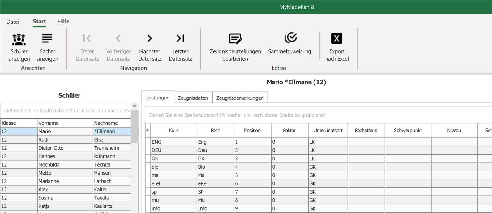

### Zeugnisdaten

Markieren Sie einen Schüler und wechseln auf die Unterkarte `Zeugnisdaten`. 

!!! info "Hinweis"

    In der nachstehenden Ansicht sehen Sie sämtliche Felder, die in dieser Ansicht möglich wären. Wenn weniger Felder gezeigt werden, bedeutet dass, das Ihr Administrator einen Teil der Felder nicht mit in die Datei übergeben hat. Das ist sinnvoll, wenn diese Daten beispielsweise per Sammelzuweisung direkt in MAGELLAN gepflegt werden.

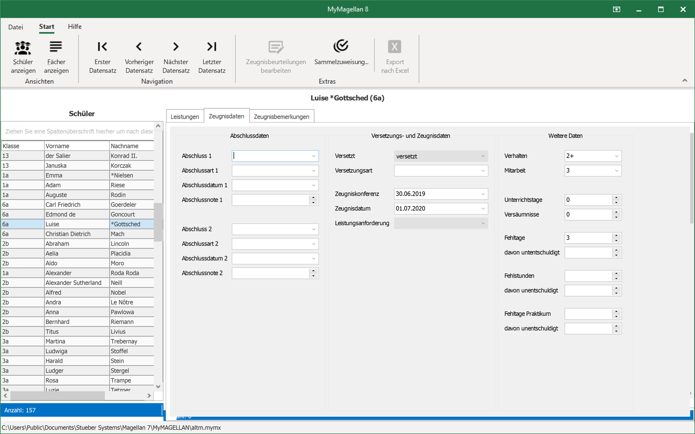

Verhalten und Mitarbeit: 
 Sind in MAGELLAN Eintragungen vorhanden auf der Registerkarte `Schüler > Zeugnis > Details` in den Feldern `Verhalten` und `Mitarbeit`, so werden diese nicht gelöscht, wenn eine mym-Datei nach MAGELLAN übertragen wird, die in den genannten Feldern keinen Eintrag enthält. 

Unterrichtstage und Versäumnisse: 
 Sind die folgenden Felder in MAGELLAN auf Registerkarte `Schüler > Zeugnis > Details` mit einem Wert gefüllt, wird dieser überschrieben, wenn eine mym-Datei eingesammelt wird, die in diesen Feldern einen Wert hat oder eine 0 beinhaltet:

* Unterrichtstage
* Versäumnisse

Fehltage, davon unentschuldigt, Fehlstunden und davon unentschuldigt: 
 Wie die nachfolgenden Felder beim Einlesen in MAGELLAN verarbeitet werden (Überschreiben, Addieren oder keine Änderung), hängt von der Einstellungen des Administrator ab, der Ihre MyMAGELLAN-Datei erstellt hat:

* Fehltage 
* davon unentschuldigt
* Fehlstunden
* davon unentschuldigt

Felder unter `Zeugnis > Zeugnis und Leistungen`: Für alle Eintragungen auf Registerkarte `Schüler > Zeugnis > Zeugnis` und alle Felder auf Registerkarte `Schüler > Zeugnis > Leistungen` gilt ebenfalls, dass dies beim Einlesen in MAGELLAN zu einem Überschreiben der bisherigen Werte in MAGELLAN führt.

Mit Null vorbesetzte Felder: Nach dem Einschulen eines Schülers in MAGELLAN sind auf der Registerkarte `Schüler > Zeugnis > Details` folgende Felder automatisch mit dem Wert 0 vorbelegt (es werden hier nur die Felder genannt, die als Eingabefeld in MyMAGELLAN existieren):

* Unterrichtstage
* Versäumnisse
* Fehltage 
* davon unentschuldigt
* Fehlstunden
* davon unentschuldigt

Es ist sowohl in MAGELLAN als auch in MyMAGELLAN nicht möglich, diese Felder zu leeren. Das bedeutet, dass bei dem Verteilen von MyMAGELLAN-Dateien in den o.g. Feldern immer ein 0-Wert ausgegeben wird, was zur Folge hat, dass beim Einsammeln dieser Dateien grundsätzlich der Wert 0 zurück nach MAGELLAN übertragen wird, wenn in MyMAGELLAN dort keine Eintragung vorgenommen wurde. Das wiederum bewirkt ein Überschreiben eines eventuell in MAGELLAN bereits vorhandenen Wertes mit dem Wert 0, wie unter Punkt 2 beschrieben.

!!! info "Fazit"

	Die mym-Datei desjenigen Lehrers, der die Zeugnisdetails der Schüler erfassen soll (in den meisten Fällen der Klassenlehrer), sollte erst eingesammelt werden, wenn die Dateien der Fachlehrer schon nach MAGELLAN übernommen wurden.

### Zeugnisbemerkungen

## Eingabe nach Fächern

Um die Daten für Ihre Schüler aus Sicht der Fächer einzugeben klicken Sie bitte auf die Schaltfläche `Fächer anzeigen` oben links in der Menüleiste.

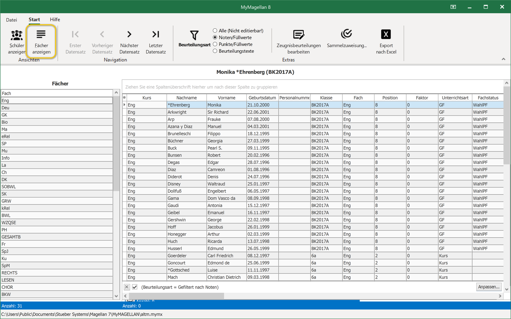

Es öffnet sich ein zweigeteiltes Fenster, auf der linken Seite wählen Sie das Fach aus, für das Sie Leistungen erfassen möchten, auf der rechten Seite werden die dazugefundenen Daten in Listenform gezeigt. 

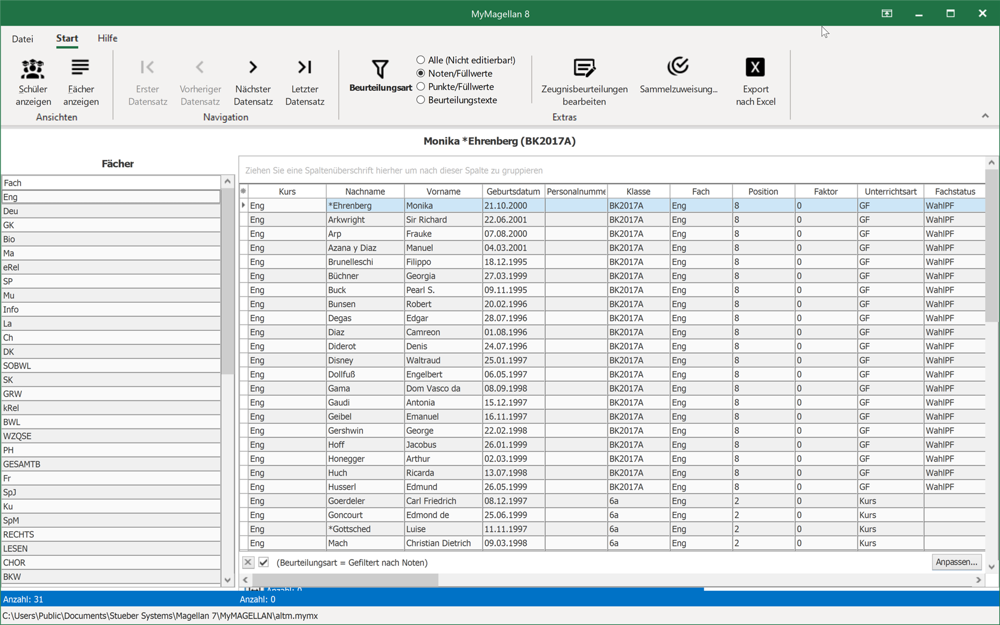

